# Customer Success Stories
> 原文链接: https://customers.microsoft.com/

---

CUSTOMER STORIES

# Learn how organizations are achieving more with Microsoft

[See all stories](https://www.microsoft.com/en-ca/customers/search)

## Get insights from leading brands

Discover how organizations are driving innovation with Microsoft solutions.

-   [

    

    ](https://www.microsoft.com/en/customers/story/26491-procter-and-gamble-company-azure)

-   [

    

    ](https://www.microsoft.com/en/customers/story/26336-lenovo-content-safety-in-foundry-control-plane)

-   [

    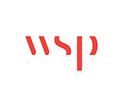

    ](https://www.microsoft.com/en/customers/story/26012-wsp-microsoft-365-copilot)

-   [

    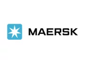

    ](https://www.microsoft.com/en/customers/story/26271-maersk-sap-on-azure)

-   [

    

    ](https://www.microsoft.com/en/customers/story/25682-nasdaq-azure)

-   [

    

    ](https://www.microsoft.com/en/customers/story/25357-kpmg-azure-ai-foundry)

-   [

    

    ](https://www.microsoft.com/en/customers/story/25662-ey-microsoft-365-copilot)

-   [

    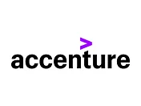

    ](https://www.microsoft.com/en/customers/story/24993-accenture-github-copilot)

-   [

    

    ](https://www.microsoft.com/en/customers/story/26354-heineken-azure-api-management)

-   [

    

    ](https://www.microsoft.com/en/customers/story/25195-ralph-lauren-azure-openai)

-   [

    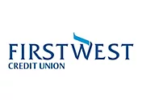

    ](https://www.microsoft.com/en/customers/story/26016-first-west-credit-union-microsoft-365-copilot)

-   [

    

    ](https://www.microsoft.com/en/customers/story/26421-zurich-north-america-azure)

Stories by industry

## See how customers are working smarter

[See all industries](https://www.microsoft.com/en-ca/customers/search)

-   Retail & Consumer Goods
-   Financial Services
-   Manufacturing
-   Healthcare
-   Education
-   Energy & Resources

"Previous"

"Next"

Showing 0 of 0 categories

Showing 1-2 of 2 slides

Previous slide Next slide

    

##### We are Microsoft

### Empowering others

Our mission is to empower every person and every organization on the planet to achieve more.

-   Microsoft

-   Apple

-   Google

[Label](#)

    

We are Microsoft

### Empowering others

Our mission is to empower every person and every organization on the planet to achieve more.

[Label](#)

[Back to Stories by industry section](javascript:void\(0\);)

Load more

Video Spotlight

# PwC modernizes across 136 countries via Microsoft 365 with Copilot, saves $150M

“We’re evolving into an AI first organization—embedding Microsoft 365 with Copilot so our people can spend more time advising clients and less time on administrative work.”

James Shira, Global and US CIO, Global CISO, PwC

[Read the story](https://www.microsoft.com/en/customers/story/26160-pwc-microsoft-365-enterprise)

STORIES by topic

## Discover ways customers are evolving

Agentic AI in Action Security Low Code Development

Previous

Next

Showing 1-2 of 2 slides

Previous Slide

1.  [

    

    ](#carousel-ocec32-0)
2.  [

    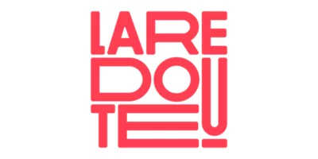

    ](#carousel-ocec32-1)

Next Slide

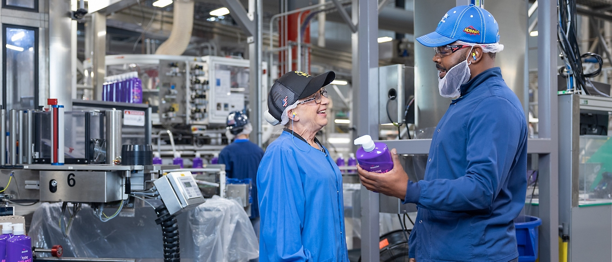

<Story Title> <Story Subtitle>

Products

-   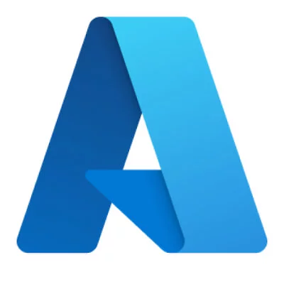

    Microsoft

-   

    Apple

Read the story

Products

[Back to carousel navigation controls](javascript:void\(0\);)

Showing 1-2 of 2 slides

Previous Slide

1.  [

    

    ](#carousel-oce355-0)
2.  

Next Slide

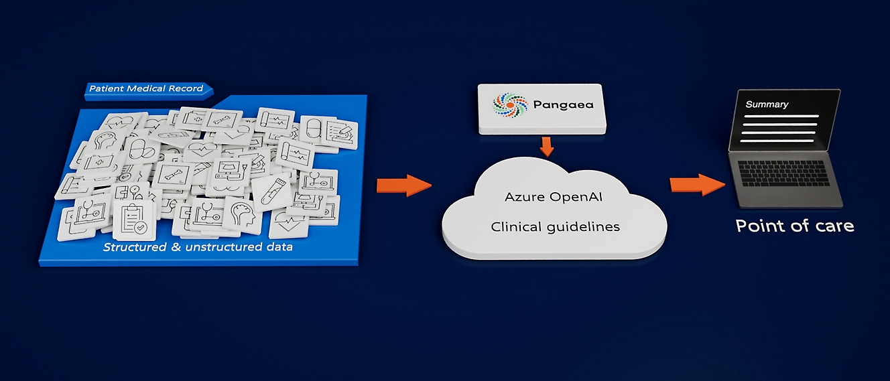

<Story Title> <Story Subtitle>

Products

-   

    Microsoft

-   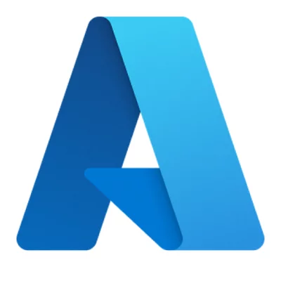

    Apple

-   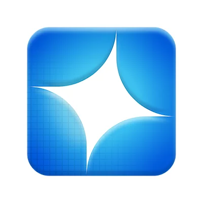

    Google

Read the story

[Back to carousel navigation controls](javascript:void\(0\);)

Showing 1-6 of 6 slides

Previous Slide

1.  [

    

    ](#carousel-oce1000235-0)
2.  [

    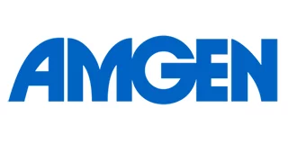

    ](#carousel-oce1000235-1)
3.  [

    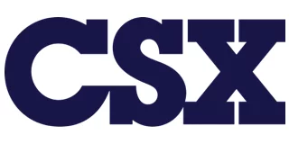

    ](#carousel-oce1000235-2)
4.  [

    

    ](#carousel-oce1000235-3)
5.  [

    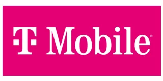

    ](#carousel-oce1000235-4)
6.  [

    

    ](#carousel-oce1000235-5)

Next Slide

> Hertz drives process automation and AI-enabled innovation with Power Platform

> An agent built with Copilot Studio is reducing the time to resolve customer issues by over 15%.

Products

-   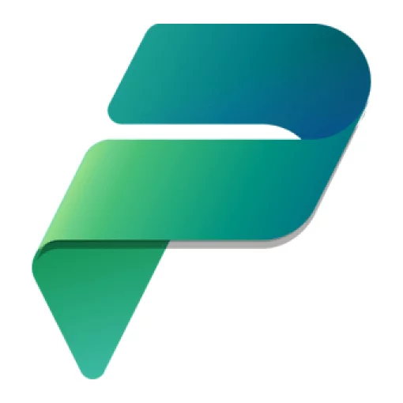

    [Microsoft Power Platform](https://go.microsoft.com/fwlink/?linkid=2288078)

-   

    [Power Apps](https://go.microsoft.com/fwlink/?linkid=2288568)

-   

    [Microsoft Copilot Studio](https://go.microsoft.com/fwlink/?linkid=2288619)

[Read the story](https://www.microsoft.com/en/customers/story/25989-hertz-microsoft-power-platform)

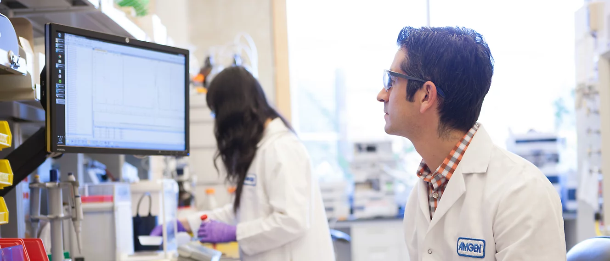

> Amgen builds agent in 6 weeks with Copilot Studio to help accelerate R&D

> Amgen’s Catalyst Copilot, created in Microsoft Copilot Studio, can help drug developers learn from one another and connect to resources more quickly, improving knowledge management across Research and Development.

Products

-   

    [Microsoft Copilot Studio](https://go.microsoft.com/fwlink/?linkid=2288619)

-   

    [Microsoft 365 Copilot](https://go.microsoft.com/fwlink/?linkid=2288168)

[Read the story](https://www.microsoft.com/en/customers/story/23550-amgen-microsoft-copilot-studio)

> CSX boosts supply chain agility using Microsoft Copilot Studio and Azure AI Foundry

> AI agent enables customers to search knowledge articles, track freight, manage shipments, and more.

Products

-   

    [Microsoft Copilot Studio](https://go.microsoft.com/fwlink/?linkid=2288619)

-   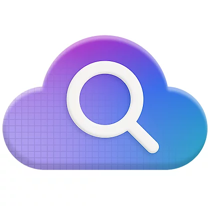

    [Azure AI Search](https://go.microsoft.com/fwlink/?linkid=2288680)

-   

    [Microsoft Power Platform](https://go.microsoft.com/fwlink/?linkid=2288078)

[Read the story](https://www.microsoft.com/en/customers/story/24556-csx-microsoft-copilot-studio)

> Global Travel Collection to reclaim 1.5M advisor hours with Azure AI Foundry and Copilot Studio

> With Azure AI Foundry, Global Travel Collection reduced the amount of time its advisors spend to plan and book complex itineraries by three hours per trip.

Products

-   

    [Azure Cosmos DB](https://go.microsoft.com/fwlink/?linkid=2288071)

-   

    [Azure App Service](https://go.microsoft.com/fwlink/?linkid=2288754)

-   

    [Azure Blob Storage](https://go.microsoft.com/fwlink/?linkid=2288847)

[Read the story](https://www.microsoft.com/en/customers/story/23943-global-travel-collection-azure-ai-foundry)

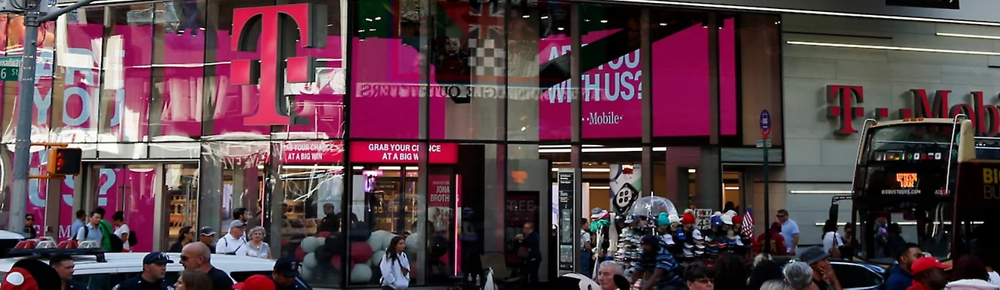

> T-Mobile drives more effective customer conversations with Microsoft Power Apps and Copilot Studio

> App with AI-driven agent becomes one of the most widely used apps in the company

Products

-   

    [Dataverse](https://go.microsoft.com/fwlink/?linkid=2288078)

-   

    [Power Apps](https://go.microsoft.com/fwlink/?linkid=2288568)

-   

    [Microsoft Copilot Studio](https://go.microsoft.com/fwlink/?linkid=2288619)

[Read the story](https://www.microsoft.com/en/customers/story/23087-t-mobile-usa-microsoft-copilot-studio)

> EY transforms its global finance operations by integrating SAP with Power Platform

> Power Apps, Power Automate, and Copilot Studio are used to streamline financial processes.

Products

-   

    [Microsoft Power Platform](https://go.microsoft.com/fwlink/?linkid=2288078)

-   

    [Dataverse](https://go.microsoft.com/fwlink/?linkid=2288078)

-   

    [Power Apps](https://go.microsoft.com/fwlink/?linkid=2288568)

[Read the story](https://www.microsoft.com/en/customers/story/25760-ey-global-services-limited-microsoft-power-platform)

[Back to SCHOOL STORIES - Education stories tab section](javascript:void\(0\);)

[Back to tabs](#tabs-pill-bar-oc3e93_tab0-tab)

Take the next step

## Fuel innovation with Microsoft

### Explore more customer stories

Find out how customers are achieving more with Microsoft products and solutions.

[Search all stories](https://www.microsoft.com/en-ca/customers/search)

### Talk to an expert about custom solutions

Let us help you create customized solutions and achieve your unique business goals.

Contact Sales

-   [

    Microsoft 365

    ](https://www.microsoft.com/en-ca/microsoft-365/business/sales-support)
-   [

    Azure

    ](https://azure.microsoft.com/en-ca/contact/)
-   [

    Dynamics 365

    ](https://go.microsoft.com/fwlink/?linkid=2268307)
-   [

    Microsoft Power Platform

    ](https://go.microsoft.com/fwlink/?linkid=2250307)
-   [

    Microsoft Teams

    ](https://go.microsoft.com/fwlink/p/?LinkID=2116890)
-   [

    Microsoft Security

    ](https://www.microsoft.com/en-ca/security/business/get-started/contact-us)
-   [Windows 365](https://www.microsoft.com/en-ca/windows-365/contact-sales)
-   [

    Nonprofit

    ](https://go.microsoft.com/fwlink/?linkid=2169450)

### Transform work with Microsoft AI

Bring intelligence into the flow of work and help your organization achieve its goals with secure, scalable AI solutions.

[Explore AI solutions](https://www.microsoft.com/en-ca/ai/)

## Follow Microsoft

-   
-   
-   