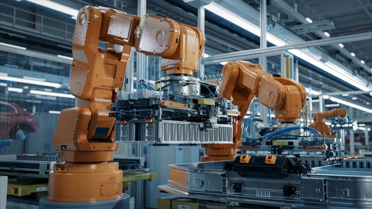
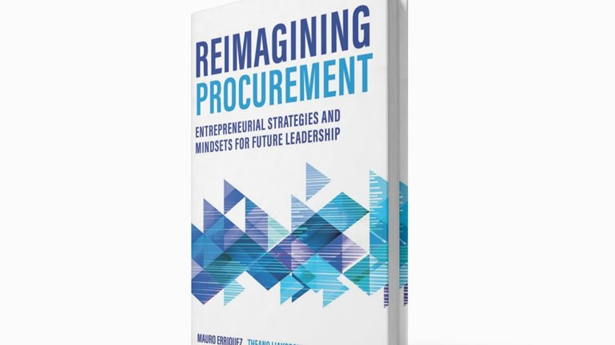
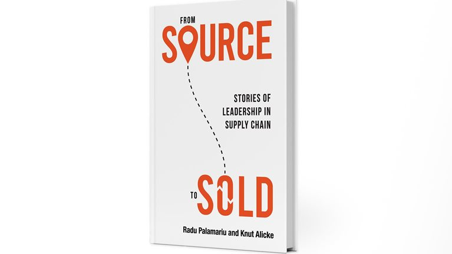

# Our Insights
> 发布时间: 2026-06-19T12:00:00Z
> 原文链接: https://www.mckinsey.com/capabilities/operations/our-insights

---

#

Insights on Operations

Operations insights to connect strategy with lasting success. Browse and enjoy articles, blogs, podcasts and interviews that span all operations functions and industry sectors.

Survey

##### [Putting AI to work: The operational excellence imperative](https://www.mckinsey.com/capabilities/operations/our-insights/putting-ai-to-work-the-operational-excellence-imperative)

June 19, 2026 -

Our survey uncovers how operational excellence becomes the hidden accelerator of AI at scale.

Article

##### [Decoding disruption to reshape manufacturing footprints](https://www.mckinsey.com/capabilities/operations/our-insights/decoding-disruption-to-reshape-manufacturing-footprints)

January 8, 2026 -

Today’s pressures mean supply chain footprints need more flexibility. Our analysis of 188 KPIs across industries reveals which...

Article

##### [An executive’s survival guide to capital projects](https://www.mckinsey.com/capabilities/operations/our-insights/an-executives-survival-guide-to-capital-projects)

April 29, 2026 -

Seven lessons in leadership from some of the world’s most complex construction projects, to help those in the executive hot seat navigate the pressures, contain the risks, and deliver success.

Article

##### [Building trust: How customer care leaders pull ahead with AI](https://www.mckinsey.com/capabilities/operations/our-insights/building-trust-how-customer-care-leaders-pull-ahead-with-ai)

February 23, 2026 -

An adoption gap is growing in the customer care space as leading organizations begin to see impact from AI across customer experience, cost reduction, and revenue generation.

Article

##### [Redefining procurement performance in the era of agentic AI](https://www.mckinsey.com/capabilities/operations/our-insights/redefining-procurement-performance-in-the-era-of-agentic-ai)

February 5, 2026 -

Agentic AI is changing what the procurement function can achieve—shifting procurement’s focus from transaction tasks to a strategic driver of growth, sustainability, and resilience.

Article

##### [From pilots to performance: How COOs can scale AI in manufacturing](https://www.mckinsey.com/capabilities/operations/our-insights/from-pilots-to-performance-how-coos-can-scale-ai-in-manufacturing)

December 15, 2025 -

A new survey of manufacturing COOs shows high hopes for scaling AI—and high budgets. But some companies may be underinvesting in the enablers needed for AI to generate lasting value.

###

Join the conversation with McKinsey Talks Operations

[Listen to the podcast](https://www.mckinsey.com/capabilities/operations/our-insights/mckinsey-talks-operations/podcast)[Read the blog](https://www.mckinsey.com/capabilities/operations/our-insights/operations-blog)[Watch the videos](https://www.mckinsey.com/capabilities/operations/our-insights/mckinsey-talks-operations/video)[Register for an event](https://mckinseytalksoperations.com/)

##

Latest Insights

Article

##### [How AI agents can help FP&A better steer the business](https://www.mckinsey.com/capabilities/operations/our-insights/how-ai-agents-can-help-fp-and-a-better-steer-the-business)

July 24, 2026 -

AI makes continuous financial planning practical at scale. Organizations can identify risks sooner, evaluate trade-offs faster, and intervene before performance gaps widen.

Article

##### [The ‘bridge builder’ COO: Delivering results by engaging stakeholders](https://www.mckinsey.com/capabilities/operations/our-insights/the-bridge-builder-coo-delivering-results-by-engaging-stakeholders)

July 15, 2026 -

Today’s COOs work with an increasingly broad set of stakeholders. Success means understanding the “why” that drives each one.

Article

##### [Gigafactory delivery on time: Solving the SOP delay challenge](https://www.mckinsey.com/capabilities/operations/our-insights/gigafactory-delivery-on-time-solving-the-sop-delay-challenge)

July 15, 2026 -

Battery plants are essential for the energy transition. Most miss their ramp-up deadlines, however. Here’s how to fix the delivery model.

Blog Post

##### [Procurement power plays: Unlocking value from legal spend](https://www.mckinsey.com/capabilities/operations/our-insights/operations-blog/procurement-power-plays-unlocking-value-from-legal-spend)

June 9, 2026 -

Partnering with procurement can shift external legal spend from a cost center to value driver, where the question isn’t just, “How much do we spend?” but “How intelligently do we spend it?”

Interview

##### [Embracing complexity: Parloa’s vision for next-gen customer experience](https://www.mckinsey.com/capabilities/operations/our-insights/embracing-complexity-parloas-vision-for-next-gen-customer-experience)

June 4, 2026 -

Chris Silver, chief revenue officer at Parloa, talks with McKinsey partner Brian Blackader about the shift to adopting AI technologies in customer care, getting to success, and how he sees the future.

Interview

##### [Global Lighthouse voices: A talk with CITIC Dicastal Morocco’s Badr Lahmoudi](https://www.mckinsey.com/capabilities/operations/our-insights/global-lighthouse-voices-a-talk-with-citic-dicastal-moroccos-badr-lahmoudi)

May 7, 2026 -

For CITIC Dicastal Morocco’s president, the honor of becoming Africa’s first Lighthouse site means sharing best practices and adding to the growth of the Moroccan economy.

Podcast

##### [Rewiring Europe: Turning pressure into performance](https://www.mckinsey.com/capabilities/operations/our-insights/rewiring-europe-turning-pressure-into-performance)

May 7, 2026 -

Europe is at a productivity inflection point, and closing the gap will require leaders to move beyond incremental fixes and rewire operations end to end with AI, speed, and scale.

Article

##### [Transforming factories: The power of continuous, connected insights](https://www.mckinsey.com/capabilities/operations/our-insights/transforming-factories-the-power-of-continuous-connected-insights)

May 1, 2026 -

By quickly connecting insights to execution, companies can accelerate their factories’ path toward manufacturing excellence and continuous improvement.

##

Special collections

Insights Collection

##### [Case Studies](https://www.mckinsey.com/capabilities/operations/case-studies)

We help clients transform performance and pursue operational excellence across functions and industries. From harnessing the...

Insights Collection

##### [Operations insights for leaders](https://www.mckinsey.com/capabilities/operations/our-insights/ceo-perspectives)

Insights to that help you to connect the boardroom to the front line, transform operations, and build resilience

Insights Collection

##### [Next-generation operational excellence](https://www.mckinsey.com/capabilities/operations/our-insights/next-generation-operational-excellence)

Uniting organizations around strategy and purpose.

Insights Collection

##### [Agentic and Gen AI in Operations](https://www.mckinsey.com/capabilities/operations/our-insights/agentic-and-gen-ai-in-operations)

Technology is only powerful if it is applied where and when it matters.

##

Want to learn more about how we help clients in Operations?

[Learn more](https://www.mckinsey.com/capabilities/operations/how-we-help-clients)

##

MORE INSIGHTS

Podcast - The McKinsey Podcast

##### [

The human advantage in an AI economy

](https://www.mckinsey.com/mhi/our-insights/the-human-advantage-in-an-ai-economy)

July 23, 2026 -

Tech investment alone won’t deliver a competitive edge. Organizations need systems that strengthen both brain health and AI-era...

Podcast

##### [

Powering supply chain with agentic AI

](https://www.mckinsey.com/capabilities/operations/our-insights/powering-supply-chain-with-agentic-ai)

July 22, 2026 -

Agentic AI could fundamentally reshape supply chain operations, but realizing its potential will require companies to move beyond...

Article

##### [

Chokepoints: How to respond when the global economy gets squeezed

](https://www.mckinsey.com/capabilities/geopolitics/our-insights/chokepoints-how-to-respond-when-the-global-economy-gets-squeezed)

July 22, 2026 -

As the situation in the Strait of Hormuz makes clear, business success increasingly depends on managing global disruption and...

Article

##### [

The future of delivering software as a medical device

](https://www.mckinsey.com/industries/life-sciences/our-insights/the-future-of-delivering-software-as-a-medical-device)

July 15, 2026 -

Software is reshaping how medtech organizations create value. A new approach to quality assurance during software-as-a-medical-device...

Article

##### [

How can the public sector meet the AI moment?

](https://www.mckinsey.com/industries/public-sector/our-insights/rewiring-public-sector)

July 15, 2026 -

AI can help public sector agencies improve outcomes for residents and make every taxpayer dollar go further. But realizing that...

Article

##### [

The continuing evolution of the Global Lighthouse Network

](https://www.mckinsey.com/capabilities/operations/our-insights/the-continuing-evolution-of-the-global-lighthouse-network)

July 13, 2026 -

The growth of the Global Lighthouse Network showcases the opportunities for Fourth Industrial Revolution technologies to make...

Article

##### [

A dual transformation agenda for Europe’s chemicals industry

](https://www.mckinsey.com/industries/chemicals/our-insights/a-dual-transformation-agenda-for-europes-chemicals-industry)

July 3, 2026 -

The strongest chemical company transformations in Europe perform a difficult balancing act: improving performance while radically...

Interview

##### [

How Miro is redefining collaboration across the product development life cycle

](https://www.mckinsey.com/capabilities/mckinsey-technology/our-insights/how-miro-is-redefining-collaboration-across-the-product-development-life-cycle)

July 2, 2026 -

Miro cofounder and CEO Andrey Khusid reflects on the company’s evolution from a digital whiteboard to an AI-powered workflow...

Report

##### [

African bedrock: How the continent’s minerals can help power the world

](https://www.mckinsey.com/industries/metals-and-mining/our-insights/african-bedrock-how-the-continents-minerals-can-help-power-the-world)

June 29, 2026 -

Critical minerals underpin everything from AI to low-carbon energy, and African mining sits at the epicenter. Three key moves...

Case Study

##### [

How KPN is building an agentic AI engine for customer care

](https://www.mckinsey.com/industries/technology-media-and-telecommunications/how-we-help-clients/how-kpn-is-building-an-agentic-ai-engine-for-customer-care)

June 24, 2026 -

By transforming its contact center with agentic AI, the leading Dutch telecom company is strengthening quality, improving efficiency,...

Survey

##### [

Putting AI to work: The operational excellence imperative

](https://www.mckinsey.com/capabilities/operations/our-insights/putting-ai-to-work-the-operational-excellence-imperative)

June 19, 2026 -

Our survey uncovers how operational excellence becomes the hidden accelerator of AI at scale.

View More

##

Related content

Book

##### [Reimagining procurement](https://www.mckinsey.com/capabilities/operations/our-insights/reimagining-procurement-book-overview)

Delve into the future of procurement as McKinsey procurement experts share their perspectives on the forces that are reshaping the procurement function in their upcoming book.

Book

##### [From Source to Sold](https://www.mckinsey.com/capabilities/operations/our-insights/from-source-to-sold)

October 10, 2022 -

An invaluable compendium of leadership wisdom and supply chain knowledge to guide supply chain professionals and their organizations.

##### [Fourth Industrial Revolution Technologies are shaping the future of production](https://www.mckinsey.com/featured-insights/world-economic-forum/knowledge-collaborations/the-future-of-production)

The Global Lighthouse Network of organizations are demonstrating how to capture their full potential.

##

Connect with our Operations Practice

[Contact us](https://www.mckinsey.com/capabilities/operations/contact-us)