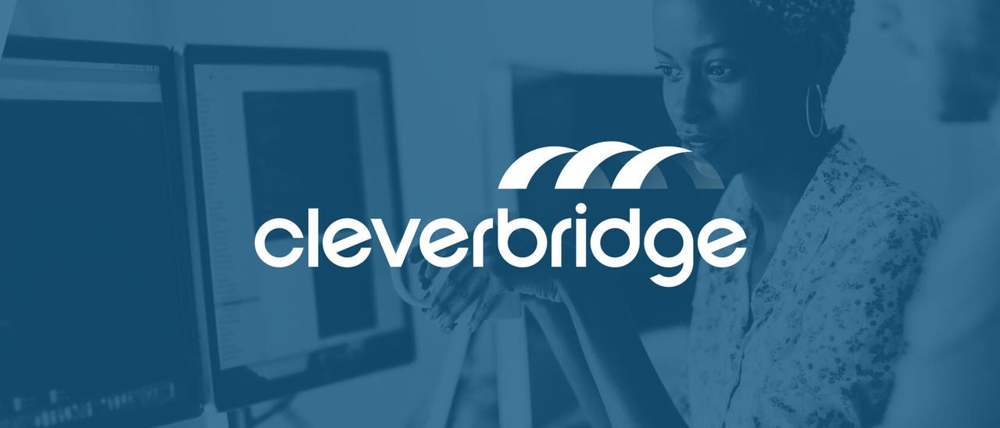
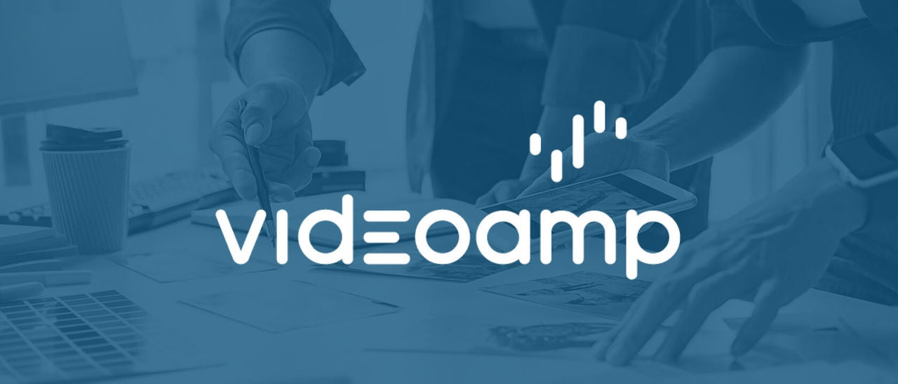
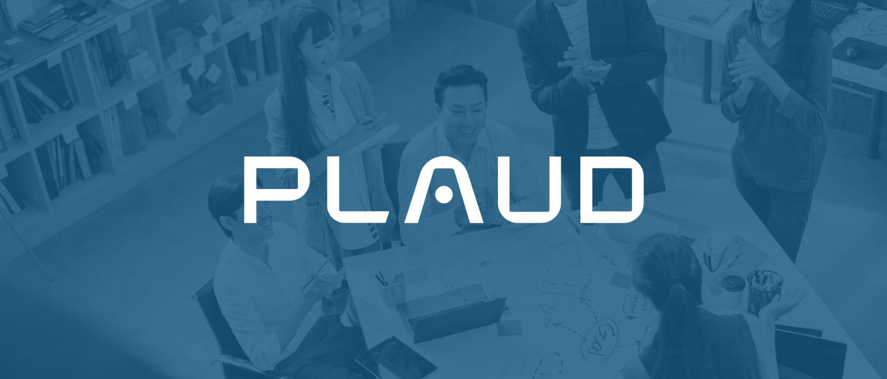
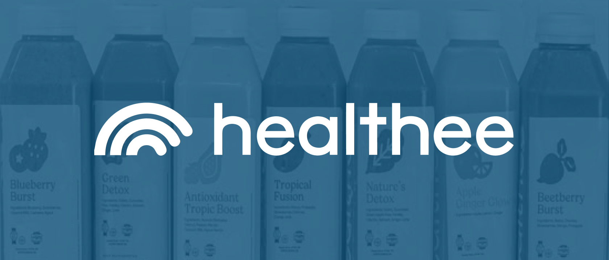
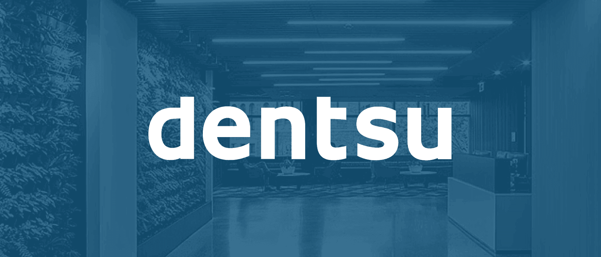
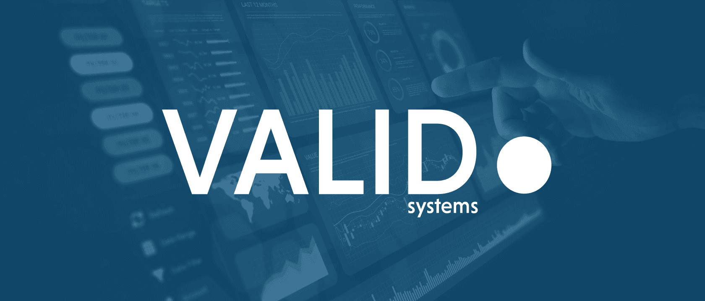
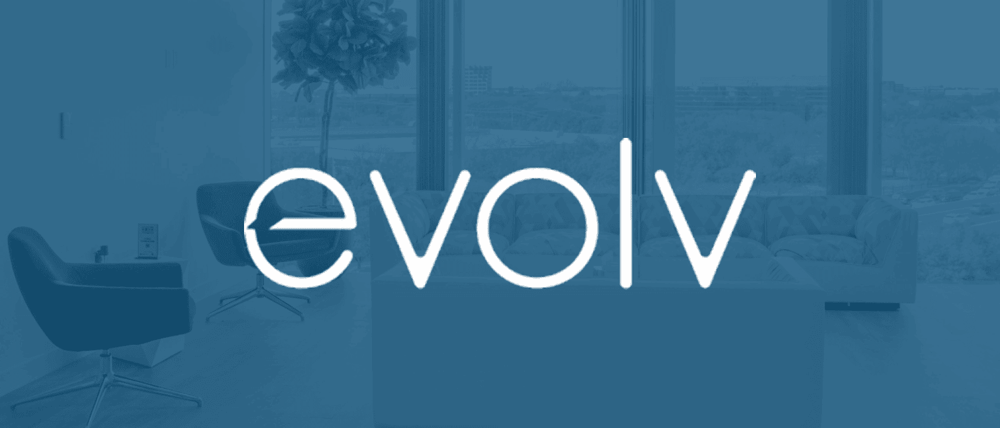
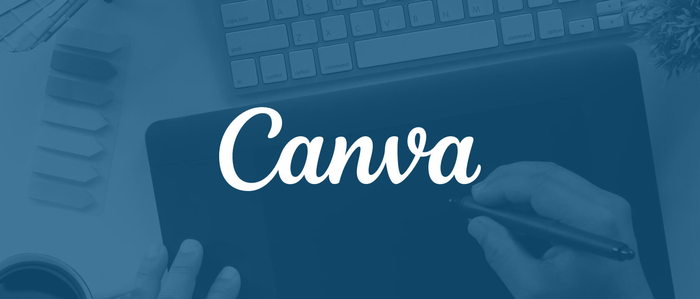
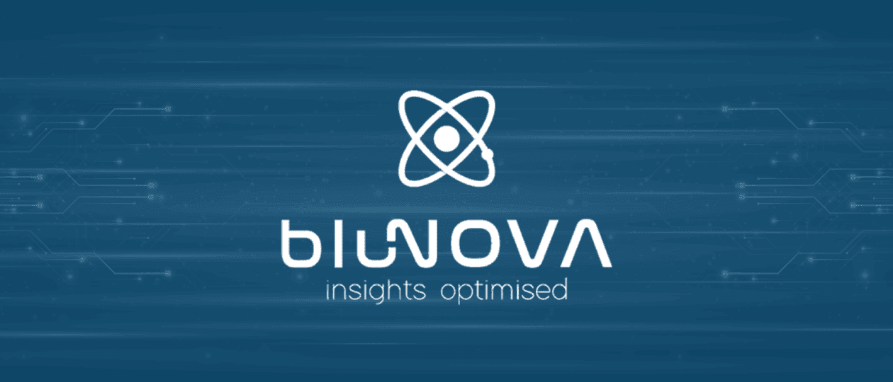

# Snowflake: All Customers
> 原文链接: https://www.snowflake.com/en/customers/all-customers/

---

[skip\_to\_content](#responsive-grid-main-content)

Snowflake World Tour hits your city

See how leading teams deploy agents at scale. Find a stop near you.

[Register free](https://www.snowflake.com/en/world-tour/)

###### OUR CUSTOMERS

# Leaders Choose Snowflake

See how organizations across industries and regions use Snowflake to be more efficient, innovative and successful.

###### Content Type

Case StudyVideoSnapshot

###### Industry

Advertising, Media & EntertainmentFinancial ServicesHealthcare & Life SciencesManufacturingPublic Sector

View more

###### Product Categories

AnalyticsAIData EngineeringApplications & Collaboration

###### Department

CybersecurityMarketing

###### Region

AmericasAPJEMEA

reset filters

363 Results

Newest - Oldest

Newest - Oldest

Oldest - Newest

Z - A

A - Z

[

Case Study

#### Cleverbridge Uses Snowflake Cortex AI to Accelerate Insights Across $1B+ in Global Software Commerce

Read More

](https://www.snowflake.com/en/customers/all-customers/case-study/cleverbridge/)[

Case Study

#### VideoAmp Unifies ML and Empowers Its Engineers on Snowflake

Read More

](https://www.snowflake.com/en/customers/all-customers/case-study/videoamp/)[

Video

#### Plaud Builds a Trusted AI Work Companion for Over 2 Million Users with Snowflake

Watch Now

](https://www.snowflake.com/en/customers/all-customers/video/plaud/)[

Case Study

#### Healthee Builds AI-Powered Health Insurance Navigation For Over 1 Million American Families with Snowflake

Read More

](https://www.snowflake.com/en/customers/all-customers/case-study/healthee/)[

Case Study

#### Optimove Makes Marketing Personal for Millions with AI

Read More

](https://www.snowflake.com/en/customers/all-customers/case-study/optimove/)[

Snapshot

#### Dentsu Ends Broken Pipelines and Reclaims Team Time Across 145+ Markets With Cortex Code

Read More

](https://www.snowflake.com/en/customers/all-customers/snapshot/dentsu/)[

Snapshot

#### Shelter Mutual’s AI Agents Are Ready When Disaster Strikes. So Is Leadership.

Read More

](https://www.snowflake.com/en/customers/all-customers/snapshot/shelter-mutual/)[

Snapshot

#### VALID Systems Catches 15–17% More Bank Fraud with Snowflake ML

Read More

](https://www.snowflake.com/en/customers/all-customers/snapshot/valid-systems/)[

Snapshot

#### evolv Consulting Delivers 60+ Business Days of Work in Just 20 With Snowflake

Read More

](https://www.snowflake.com/en/customers/all-customers/snapshot/evolv/)[

Video

#### TF1 Delivers a Personalized Experience 26 Million Logged-In Users

Watch Now

](https://www.snowflake.com/en/customers/all-customers/video/tf1/)[

Video

#### Canva Evolves from Design Platform to AI Powerhouse with Snowflake

Watch Now

](https://www.snowflake.com/en/customers/all-customers/video/canva1/)[

Video

#### BluNova Transforms Data-Driven Insights into Product Innovation and Scalable Micro Lending

Watch Now

](https://www.snowflake.com/en/customers/all-customers/video/bluenova/)

Previous

1

2

3

4

5

...

31

Next

## Where Data Does More

[Start for free](https://signup.snowflake.com/)

[Watch a demo](https://www.snowflake.com/en/webinars/demo/)

**Subscribe to our monthly newsletter**

Stay up to date on Snowflake’s latest products, expert insights and resources—right in your inbox!

Product

-   [Platform](https://www.snowflake.com/en/product/platform/)
-   [Snowflake CoWork](https://www.snowflake.com/en/product/snowflake-cowork/)
-   [Data Engineering](https://www.snowflake.com/en/product/data-engineering/)
-   [Analytics](https://www.snowflake.com/en/product/analytics/)
-   [AI](https://www.snowflake.com/en/product/ai/)
-   [Applications & Collaboration](https://www.snowflake.com/en/product/applications-and-collaboration/)
-   [Pricing](https://www.snowflake.com/en/pricing-options/)

Support

-   [Support](https://www.snowflake.com/en/support/)
-   [Priority Support](https://www.snowflake.com/en/legal/addenda/priority-support-services-description/)
-   [Status](https://status.snowflake.com/)

[Industries](https://www.snowflake.com/en/solutions/industries/)

-   [Advertising, Media & Entertainment](https://www.snowflake.com/en/solutions/industries/advertising-media-entertainment/)
-   [Financial Services](https://www.snowflake.com/en/solutions/industries/financial-services/)
-   [Healthcare & Life Sciences](https://www.snowflake.com/en/solutions/industries/healthcare-and-life-sciences/)
-   [Manufacturing](https://www.snowflake.com/en/solutions/industries/manufacturing/)
-   [Public Sector](https://www.snowflake.com/en/solutions/industries/public-sector/)
-   [Retail & Consumer Goods](https://www.snowflake.com/en/solutions/industries/retail-consumer-goods/)
-   [Telecom](https://www.snowflake.com/en/solutions/industries/telecom/)
-   [Technology](https://www.snowflake.com/en/solutions/industries/technology/)

Company

-   [About Snowflake](https://www.snowflake.com/en/company/overview/about-snowflake/)
-   [Leadership & Board](https://www.snowflake.com/en/company/overview/leadership-and-board/)
-   [Careers](https://careers.snowflake.com/us/en)
-   [Investor Relations](https://investors.snowflake.com/overview/default.aspx)
-   [Trust Center](https://trust.snowflake.com/)
-   [Brand Guidelines](https://www.snowflake.com/brand-guidelines/)
-   [Contact](https://www.snowflake.com/en/contact/)
-   [Newsroom](https://www.snowflake.com/en/news/)
-   [Environmental, Social & Governance](https://www.snowflake.com/en/company/overview/esg/)
-   [Snowflake Ventures](https://www.snowflake.com/en/company/overview/snowflake-ventures/)
-   [End Data Disparity](https://www.snowflake.com/en/company/overview/end-data-disparity/)
-   [Snowflake Summit 26](https://www.snowflake.com/en/summit/)

Learn

-   [Resource Library](https://snowflake.com/en/resources/)
-   [Live Demos](https://www.snowflake.com/en/webinars/demo/)
-   [Fundamentals](https://www.snowflake.com/en/fundamentals/)
-   [Training](https://www.snowflake.com/en/resources/learn/training/)
-   [Certifications](https://www.snowflake.com/en/resources/learn/certifications/)
-   [Snowflake University](https://learn.snowflake.com/en/)
-   [Developer Guides](https://www.snowflake.com/en/developers/guides)
-   [Documentation](https://docs.snowflake.com/)
-   [Data Governance](https://www.snowflake.com/en/data-governance/)

-   © 2026 Snowflake Inc. All Rights Reserved
-   [Privacy Policy](https://www.snowflake.com/en/legal/privacy/privacy-policy/)
-   [Site Terms](https://snowflake.com/en/legal/snowflake-site-terms/)
-   [Communication Preferences](https://info.snowflake.com/Preference-center.html)
-   Cookie Settings
-   [Do Not Share My Personal Information](https://www.snowflake.com/en/legal/privacy/privacy-policy/#12)
-   [Legal](https://www.snowflake.com/en/legal/)

")

## Privacy Preference Center

Opt-Out Request Honored

## Privacy Preference Center

-   ### Your Privacy

-   ### Strictly Necessary Cookies

-   ### Performance Cookies

-   ### Functional Cookies

-   ### Targeting Cookies

#### Your Privacy

When you visit any website, it may store or retrieve information on your browser, mostly in the form of cookies. This information might be about you, your preferences, or your device, and is mostly used to make the site work as you expect. The information does not usually identify you directly, but it can give you a more personalized web experience. Because we respect your right to privacy, you can choose not to allow some types of cookies. Click on the different category headings to learn more and change our default settings. Blocking some types of cookies may impact your experience of the site and the services we are able to offer.
[More information](https://cookiepedia.co.uk/giving-consent-to-cookies)

#### Strictly Necessary Cookies

Always Active

These cookies are necessary for the website to function and cannot be switched off. They are usually only set in response to actions made by you which amount to a request for services, such as setting your privacy preferences, logging in or filling in forms. You can set your browser to block or alert you about these cookies, but some parts of the site will not then work. These cookies do not store any personally identifiable information.

Cookies Details

#### Performance Cookies

 Performance Cookies

These cookies allow us to count visits and traffic sources so we can measure and improve the performance of our site. They help us to know which pages are the most and least popular and see how visitors move around the site.    All information these cookies collect is aggregated and therefore anonymous. If you do not allow these cookies we will not know when you have visited our site, and will not be able to monitor its performance.

Cookies Details

#### Functional Cookies

 Functional Cookies

These cookies enable the website to provide enhanced functionality and personalisation. They may be set by us or by third party providers whose services we have added to our pages.    If you do not allow these cookies then some or all of these services may not function properly.

Cookies Details

#### Targeting Cookies

 Targeting Cookies

These cookies may be set through our site by our advertising partners. They may be used by those companies to build a profile of your interests and show you relevant adverts on other sites. They do not store directly identifiable personal information, but are based on uniquely identifying your browser and internet device. If you do not allow these cookies, you will experience less targeted advertising.

Cookies Details

### Cookie List

Consent Leg.Interest

 checkbox label label

 checkbox label label

 checkbox label label

Clear

-    checkbox label label

Apply Cancel

Confirm My Choices

Allow All

## 来自 iframe: https://www.snowflake.com/en/customers/all-customers/